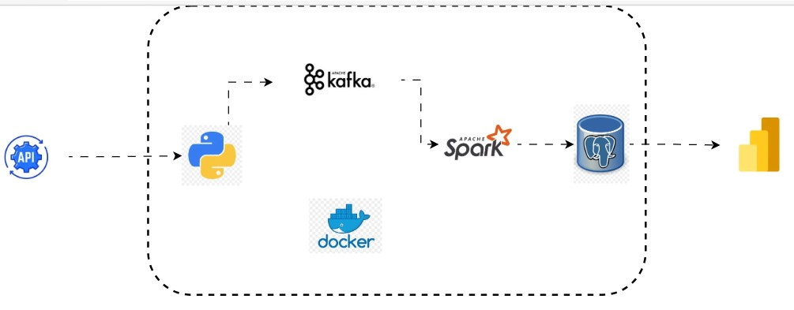

### Project Name: Real Time Stock Market Analysis

The project implements a real-time data pipeline that extracts stock data from vantage API, streams it through Apache kafka, processes it with Apache Spark, and loads it into a postgres database.

All components are containerised with Docker for easy deployment.

### Data Pipeline Architecture

Project Tech Stack and Flow
- `kafka UI →insoect topics/messages.`
- `API → produces JSON events into kafka.`
- `Spark → consumes from kafka, writes to postgres.`
- `Postgres → stores results for analytics.`
- `pgAdmin → manage Postgres visually.`
- `Power BI → external (connects to Postgres database).`